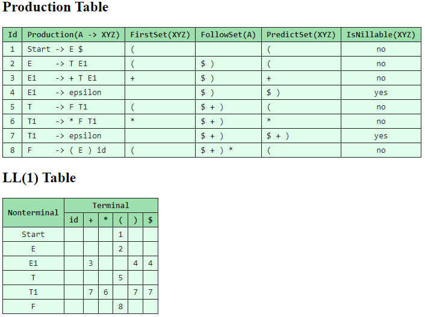

# cpp-syntax-analyzer
This is a tool used to parse LL1 grammar.

```
cpp-syntax-analyzer [options] <file>

It is used to parse LL1 grammar.

Options:
  -o --out <file>       specify output filename.
  -v --version          show version.
  -h --help             show help.
```

>TODO: Add LR0, SLR, LALR grammar support.
# Example
Input file example.  
```
E   -> T E1
E1  -> + T E1
E1  -> epsilon
T   -> F T1
T1  -> * F T1
T1  -> epsilon
F   -> ( E ) id
```

Output example.  
  

# Input file grammar
```BNF
Start           ->  ProductionList
ProductionList  ->  ProductionList Production | Production
Production      ->  SYMBOL POINTER SymbolList NEWLINE
SymbolList      ->  SymbolList Symbol | Symbol

SYMBOL          ->  CHARS | STRING
CHARS           ->  [^|\"\n\r\v\f\t ]+
STRING          ->  ["](\\.|[^\\"\n])+["]
POINTER         ->  "->"
NEWLINE         ->  [\r]?[\n]
SPACES          ->  [\t ]+
```
## Some of the symbol (or token) definition.
```C++
auto constexpr epsilon  = "epsilon";  // The "empty string" token.
auto constexpr eof      = "$";        // The "End Of File" token.
auto constexpr start    = "Start";    // Reserved token for the start production.
```

# How to build it

Install [GCC](https://gcc.gnu.org/) [flex](https://github.com/westes/flex) [bison](https://www.gnu.org/software/bison/) [cmake](https://www.cmake.org/), then run follow commands to build it.
```Bash
cmake -S . -B build
cmake --build build
```